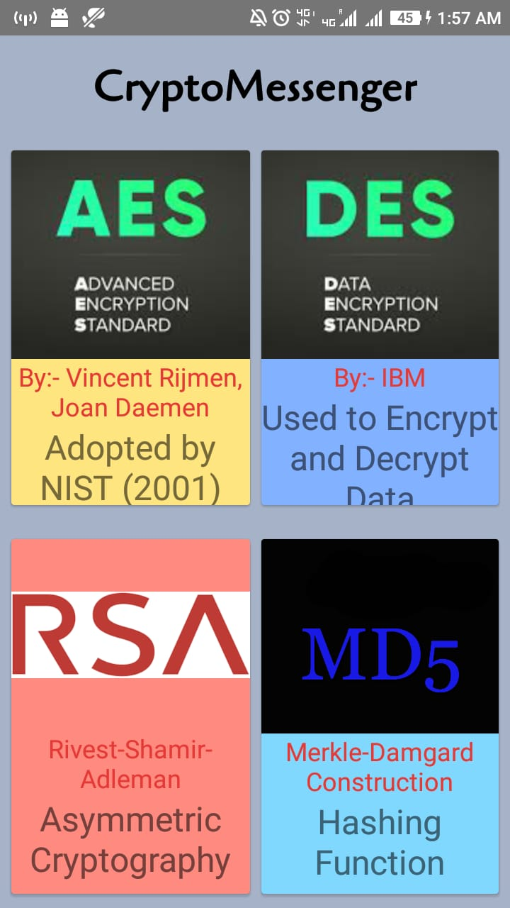
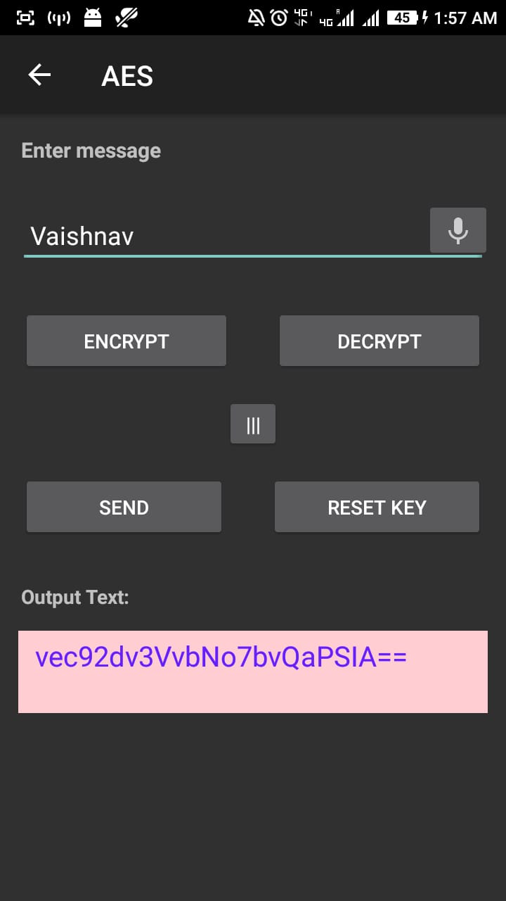
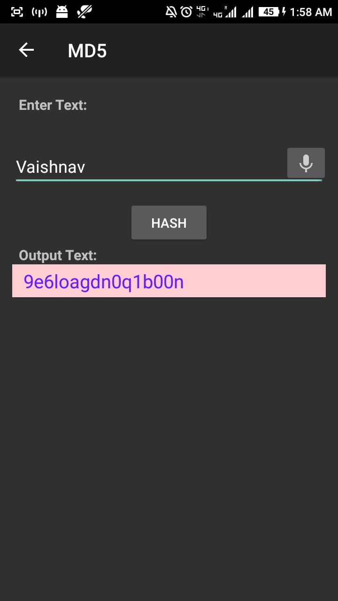

# CryptoMessenger
CryptoMessenger allows you to use various CRYPTOGRAPHY algorithms to encrypt and decrypt messages . I have AES, DES, RSA algorithms to choose from and MD5 hashing technique . This project is made in KOTLIN using Android Studio

AES
---------------------------------------------------------------------------
Known as Advanced Encryption Standard , adopted by NIST as a specification for encrypting electronic data in 2001.
It was developed by Vincent Rijmen, Joan Daemen.
It uses Substitution–permutation network.
It uses 128 bit or 196 bit or 256 bit key length and contains 10 , 12 or 14 round of Substitution–permutation respectively 

DES
---------------------------------------------------------------------------
Known as Data Encryption Standard.The Data Encryption Standard is a symmetric-key algorithm for the encryption of digital data.
Although its short key length of 56 bits(64 bits initially) makes it too insecure for applications, it has been highly influential in the advancement of cryptography.
It is based on fiestel network and has 16 rounds of identical operations. It was developed by IBM

RSA
---------------------------------------------------------------------------
RSA is a public-key cryptosystem that is widely used for secure data transmission. It is also one of the oldest. 
The acronym RSA comes from the surnames of Ron Rivest, Adi Shamir, and Leonard Adleman, who publicly described the algorithm in 1977. It uses the concept of public and private keys.
It is widely used to secure sensitive data, particularly when it is being sent over an insecure network such as the internet.

MD5
----------------------------------------------------------------------------
Message Digest Algorithm 5 (MD5) is a cryptographic hash algorithm that can be used to create a 128-bit string value from an arbitrary length string.
Although there has been insecurities identified with MD5, it is still widely used. MD5 is most commonly used to verify the integrity of files

   
